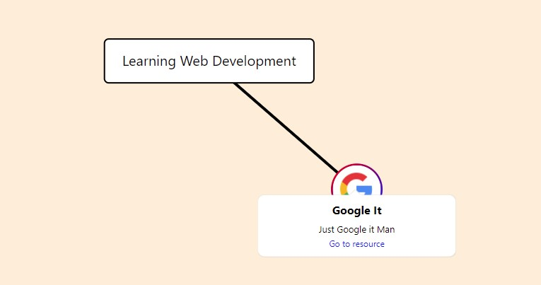

<h1 align="center">Roadmapedia</h1>

Create and share learning Roadmaps to the world (under development)

## Demo

Play with Roadmap creator demo on [`Netlify`](https://hungry-booth-c8ab84.netlify.app/)

## What is Roadmapedia?

### Motive

Self learning is essential but painful. When I started learning web development a couple years ago, googling "how to learn web dev" led to vastly different and fragmented quora answers (now it's a lot better). I wished I could've just opened up this fully-fledged and beautiful roadmap that shows what I need to learn, the recommended resources for each topic, and a writeup that clarifies some advanced jargons.

There are good learning outlines on, for example, on learning web-dev: https://roadmap.sh/frontend

There are good link and resource dumps: https://codepen.io/dexoplanet/full/oKXorG

Why not combine them both? With a more beatiful and consistent UI, and let users track their progress, etc etc?!

### Features

- Roadmap Creator: Designed with substantial D3.js and a [`Medium`](https://medium.com/) like rich text editor.
  
- Learners can track and update progress (progress made with checking off resource nodes).
  
- Users can create Sets, listing smaller roadmaps.
  
- Learners can make private roadmaps for themselves from scratch, or they can import existing roadmaps into the creator.

## Older Versions

(The full stack sites won't function since I need to migrate database and resolve a persistent proxy error) 

[`Roadmapedia V1 (MERN Stack)`](https://arcane-scrubland-73229.herokuapp.com/)

[`Roadmapedia V2 (MERN Stack)`](https://quiet-brushlands-45755.herokuapp.com/)

Below are demos of their editors 

[`Roadmapedia V1 Editor`](https://roadmapedia-v1-editor.herokuapp.com/)

[`Roadmapedia V2 Editor`](https://roadmapedia-v2-editor.herokuapp.com/)

Although far from professional levels, these were full stack application, and you can good a feel for the features I was going for.  

## Connect

Discord: https://discord.gg/WD82qNM

## Notes

As of February, the code in this remote repo only contains that of the Roadmap Creator's. I omit from uploading all of my work thus far because I believe I am switching serverless platforms soon.

Technologies used in this project

Frontend: CRA ReactJS, Sass, D3.js, Snowpack

Backend + Database: MongoDB Stitch (current), Firebase (perhaps in future)

Feel free to play around with this source code
